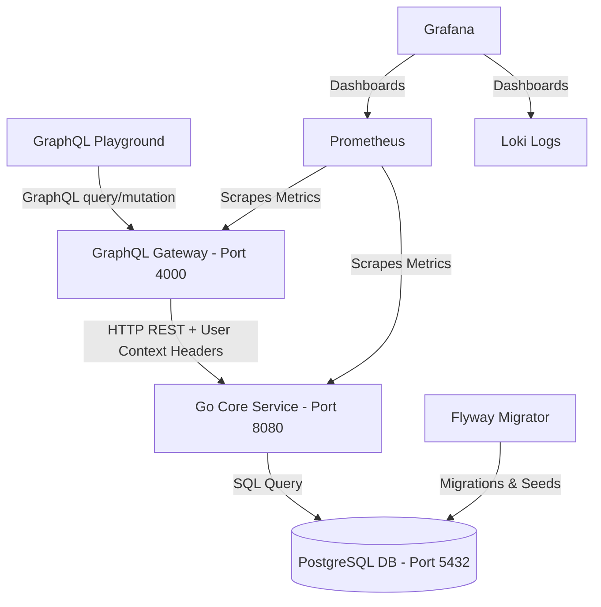

# SETA DAM Backend MVP

This project implements the backend MVP for the SETA Digital Asset Manager (DAM). It is a backend-only system for managing image text metadata organized in a hierarchical folder tree.

The system features:
1. **Node.js (TypeScript) GraphQL Gateway**: Handles schema parsing, structural validation, and authentication parsing.
2. **Go Core Domain Service**: Processes folder CRUD, tree operations, cycle detection, metadata entries, and evaluates access permissions.
3. **PostgreSQL**: Relational database storage.
4. **Flyway**: Auto-manages database migrations.
5. **Observability Stack**: Prometheus metrics scraping, Loki log aggregator, and Grafana visualization dashboard.

---

## Technical Architecture



For more detailed information, please read the documents inside the `/docs` directory:
- [docs/architecture.md](docs/architecture.md)
- [docs/tech-stack.md](docs/tech-stack.md)
- [docs/api-scope.md](docs/api-scope.md)
- [docs/database-design.md](docs/database-design.md)
- [docs/permission-design.md](docs/permission-design.md)

---

## Folder Structure

```text
seta-dam-backend/
├── apps/
│   └── graphql-node/          # Node.js GraphQL API gateway
├── services/
│   └── core-go/               # Go REST core domain service
├── db/
│   ├── migrations/            # Flyway migrations
│   └── seeds/                 # Demo SQL seed files
├── infra/
│   ├── prometheus/            # Prometheus configuration
│   ├── loki/                  # Loki configuration
│   └── grafana/               # Grafana dashboards
├── docs/                      # Technical specification documents
└── scripts/                   # Local development control scripts
```

---

## Local Development Setup

### Prerequisites
- Docker & Docker Compose installed.

### 1. Start Services
To spin up all services (Postgres, Flyway, Go backend, Node.js gateway, Prometheus, Grafana, Loki):
```bash
./scripts/dev-up.sh
```

### 2. Run Database Migrations
Migrations run automatically on startup via the Flyway service. To trigger them manually at any point:
```bash
./scripts/migrate.sh
```

### 3. Load Demo Seed Data
To load deterministic mock folders, metadata, and object-level permissions (viewer/editor restrictions):
```bash
./scripts/seed-demo.sh
```

### 4. Stop Services & Clear Volumes
To tear down the environment and wipe database volumes:
```bash
./scripts/dev-down.sh
```

---

## Codebase Walkthrough

### Mock Authentication & Context Passing
To perform query actions as different roles:
Send an `Authorization` header with one of the mock user usernames:
- `admin_user`: Bypasses all permissions (`trainer_admin` role).
- `editor_user`: Can write inside permitted folders (`editor` role).
- `viewer_user`: Read-only user (`viewer` role).

Example GraphQL Request Header:
```json
{
  "Authorization": "admin_user"
}
```

### Access Control Rules
The Go service enforces object-level access rules:
- Permissions set on parent folders automatically **inherit downwards** to subfolders and metadata items.
- Check folder operations (CRUD) against the folder tree ancestry using a PostgreSQL recursive CTE.
- Validate folder deletions to verify they do not contain child folders or metadata (preventing unsafe deletions).
- Block folder moves that would create cycles (e.g. moving a folder into its own subfolder).
