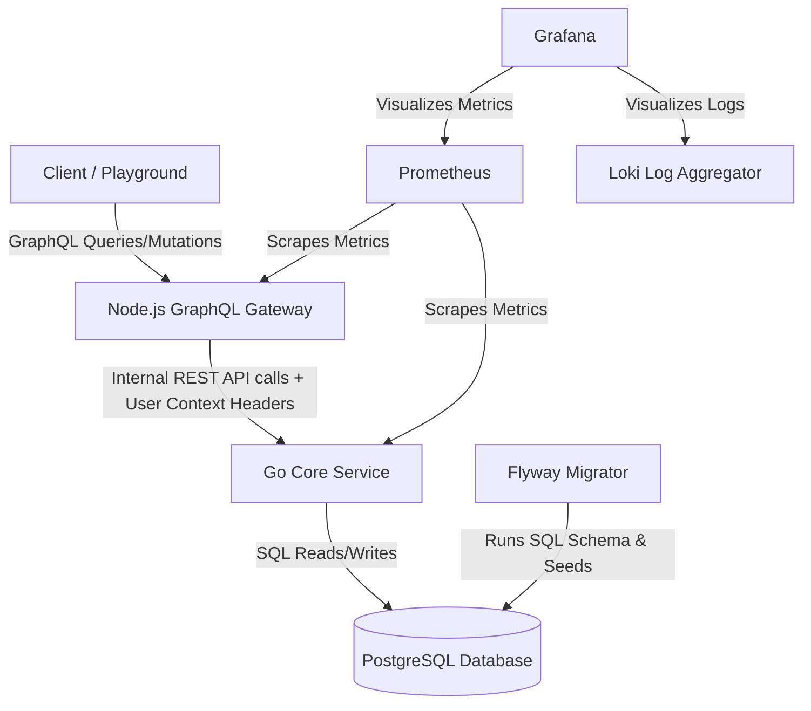

# System Architecture

This document describes the high-level architecture of the SETA DAM backend.

## Architecture Diagram

## Request Flow
1. **Authentication (Mocked)**: The client provides user identity in the request header (e.g. `Authorization: admin_user`).
2. **GraphQL Gateway Layer**: Node.js extracts the header, builds a `Context` containing user ID, username, and role, and performs structural validation of query input.
3. **Internal API Routing**: Node.js forwards queries/mutations to the Go REST Service, propagating context details via standard headers (`X-User-ID`, `X-User-Role`, `X-User-Username`).
4. **Access Control (Go)**: The Go Service checks if the user has appropriate permissions:
   - For folders: checks the folder tree recursively (using recursive CTE) for direct/inherited permissions.
   - For metadata: checks direct metadata permissions or inherits folder-level permissions.
5. **Database Interaction**: If authorized, Go updates/fetches Postgres database values and returns the result.
