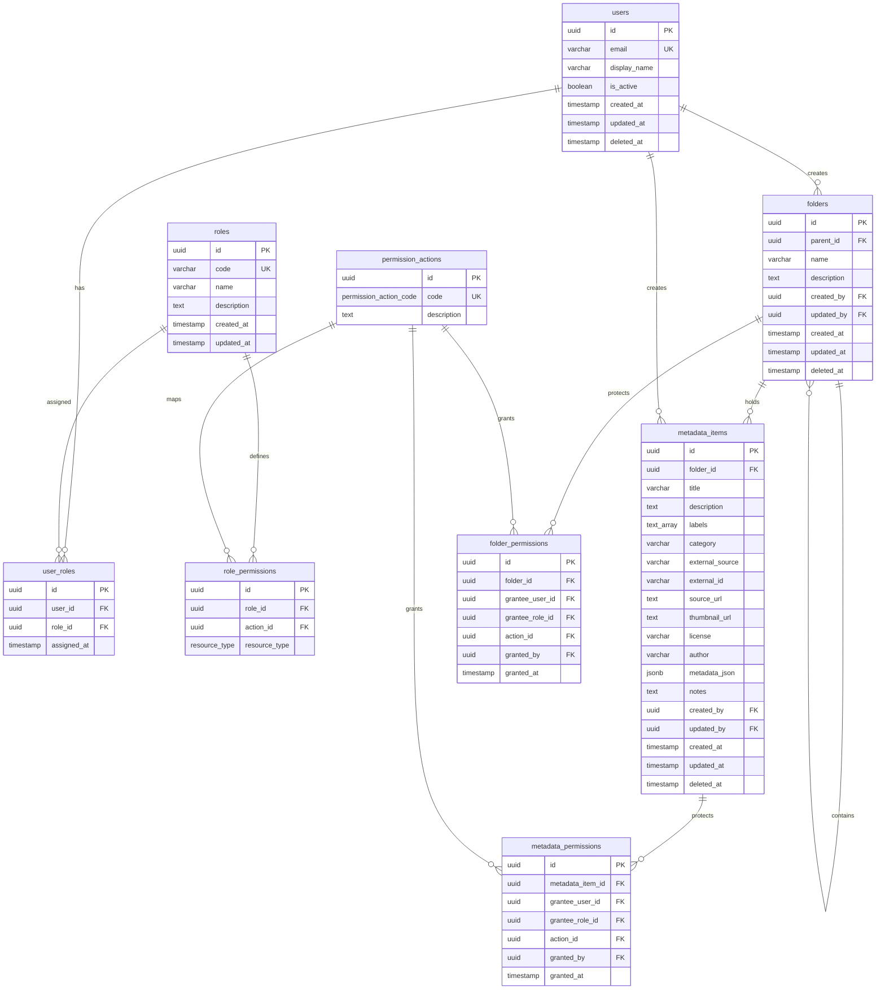

# Database Design

This document details the PostgreSQL schema designed for the SETA DAM backend.

## Entity Relationship Diagram

## Schema Details

### Tables
1. **users**: Stores identity credentials and profile info.
2. **roles**: Master list of role classifications (`trainer_admin`, `editor`, `viewer`).
3. **user_roles**: Joins users to roles.
4. **permission_actions**: Maps actions (`read`, `write`, `manage_permissions`) to specific enum values.
5. **role_permissions**: Maps roles to global actions and resource types.
6. **folders**: Represents hierarchical folder structures, supporting description and creator/updater fields, along with soft-delete metadata.
7. **metadata_items**: Stores flat, image-less metadata files mapping text descriptions, labels, categories, external source IDs, licensing details, JSON custom metadata, and soft-delete states.
8. **folder_permissions**: Direct ACL mapping of privileges (`read`, `write`, `manage_permissions`) on folders to a specific user or role.
9. **metadata_permissions**: Direct ACL mapping of privileges on metadata items to a specific user or role.

### Constraints & Indexes
- Foreign key constraints ensure strict referential integrity.
- Unique constraints (`uq_folder_permissions_user`, `uq_folder_permissions_role`, etc.) prevent duplicate permissions mappings.
- Parent ID index speeds up tree traversal.
- GIN indexes speed up `labels` array and `metadata_json` searches.
- Index filter `deleted_at IS NULL` supports efficient soft-deleted record exclusion.

