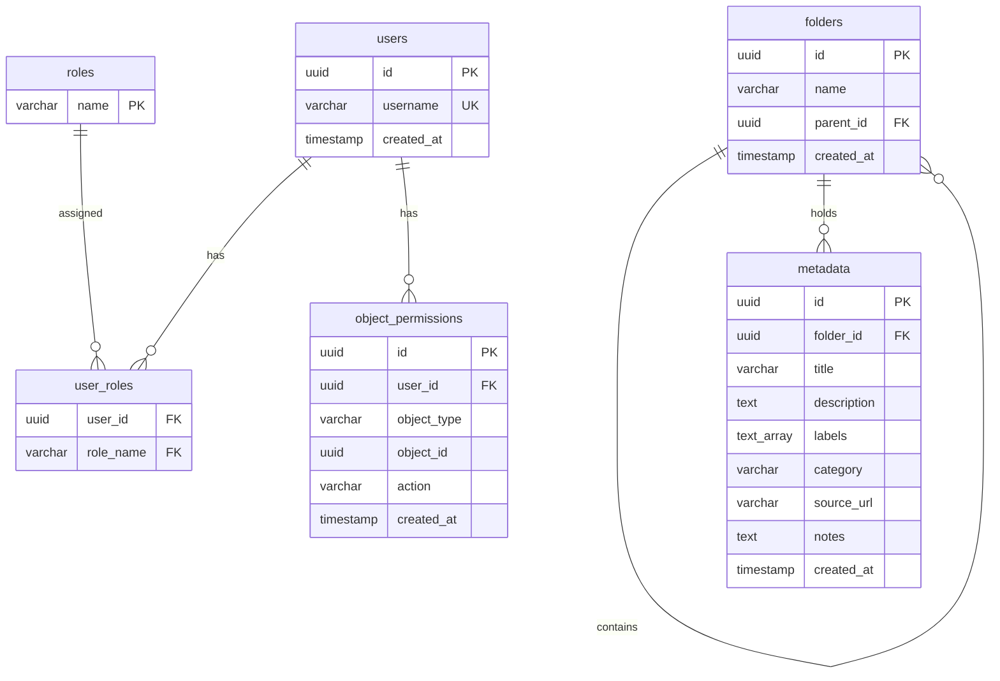

# Database Design

This document details the PostgreSQL schema designed for the SETA DAM backend.

## Entity Relationship Diagram

## Schema Details

### Tables
1. **users**: Stores identity credentials.
2. **roles**: Master list of role classifications (`trainer_admin`, `editor`, `viewer`).
3. **user_roles**: Joins users to roles.
4. **folders**: Represents hierarchical folder structures. Cycle detection is validated programmatically, and deletion checks enforce empty states.
5. **metadata**: Stores flat, image-less metadata files mapping text descriptions, labels, categories, and sources.
6. **object_permissions**: Direct user overrides mapping specific privileges (`read`, `write`, `manage_permissions`) to specific folders or metadata objects.

### Constraints & Indexes
- Foreign key constraints ensure strict referential integrity.
- Unique constraints (`unique_user_object_action`) enforce a single assignment pattern for object permissions.
- Parent ID indexes speed up tree traversal.
