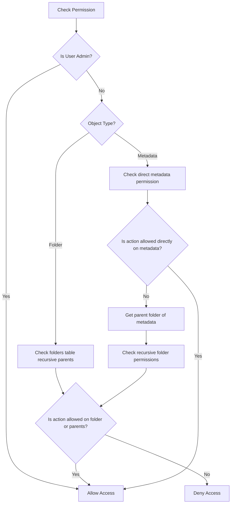

# Permission Design

This document details the security design and permission evaluation algorithm of the SETA DAM backend.

## Roles Scope (RBAC)
- **trainer_admin**: Global superuser. Bypasses all object-level evaluations and is permitted to perform all actions on all folders, metadata items, roles, and user permission configurations.
- **editor**: Authorized to view, create, and modify folders and metadata items. However, to execute actions on specific protected resources, they must possess direct or inherited object-level `write` permissions.
- **viewer**: Read-only user. Can list/view folders and metadata items, but is strictly blocked from making modifications. Requires direct or inherited `read` object-level permissions.

## Object-level Permissions
Supported actions on specific folder or metadata IDs:
- `read`: View the resource and query details.
- `write`: Edit fields, move folders, create sub-items, or delete (if empty).
- `manage_permissions`: Grant/revoke permissions on the target object.

---

## Hierarchical Evaluation Algorithm

When a user tries to perform an action on a resource, the Go evaluator follows this flowchart:

### Folder Evaluation (Recursive CTE)
To determine if a user is allowed to perform `read` on `/Dataset A/Images/Subfolder`:
1. Find if user has direct permission on `Subfolder`.
2. If not, traverse up to `Images` and check permissions.
3. If not, traverse up to `Dataset A` and check permissions.
4. If none of these folders have a permission record for the user and action, access is denied.
