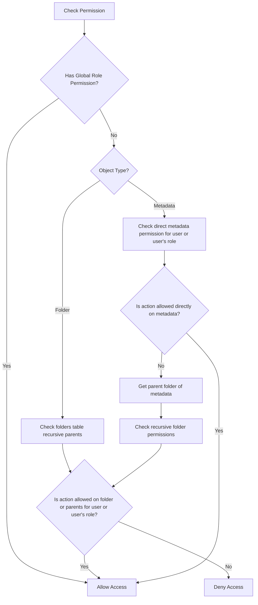

# Permission Design

This document details the security design and permission evaluation algorithm of the SETA DAM backend.

## Roles Scope (RBAC)
- **trainer_admin**: Global superuser. Bypasses all object-level evaluations and is permitted to perform all actions on all folders, metadata items, roles, and user permission configurations.
- **editor**: Authorized to view, create, and modify folders and metadata items globally (via `role_permissions`), unless blocked by parent folder restrictions.
- **viewer**: Read-only user globally (via `role_permissions`). Can list/view folders and metadata items, but is strictly blocked from making modifications.

## Object-level Permissions (ACL)
Supported actions on specific folder or metadata IDs:
- `read`: View the resource and query details.
- `write`: Edit fields, move folders, create sub-items, or delete (if empty).
- `manage_permissions`: Grant/revoke permissions on the target object.

Privileges are granted in:
- `folder_permissions`: Binds folder-level access to a specific `grantee_user_id` or `grantee_role_id`.
- `metadata_permissions`: Binds metadata-level access to a specific `grantee_user_id` or `grantee_role_id`.

---

## Hierarchical Evaluation Algorithm

When a user tries to perform an action on a resource, the Go evaluator follows this flowchart:

### Folder Evaluation (Recursive CTE)
To determine if a user is allowed to perform `read` on `/Dataset A/Images/Subfolder`:
1. Check if user's role has global permission mapping to the action and resource type `folder`.
2. Find if the user (or any role assigned to the user) has direct permission on `Subfolder` in `folder_permissions`.
3. If not, traverse up to `Images` and check permissions.
4. If not, traverse up to `Dataset A` and check permissions.
5. If none of these folders have a matching permission record, access is denied.

